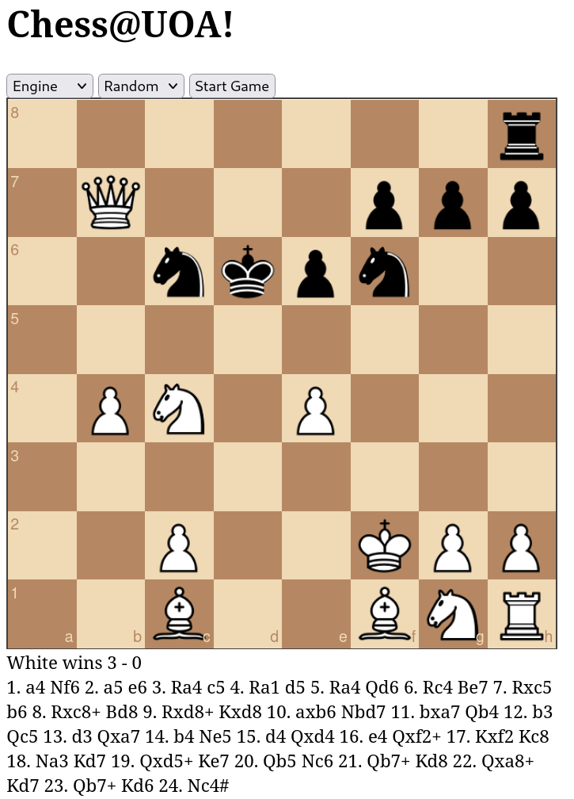

# Chess Engine

Artificial Intelligence (AI) is advancing rapidly in today’s world and manages to complete a wide spectrum of tasks. For example, AI has managed to 'solve' games like Checkers and is able to win against every opponent. However, while there are plenty of strong AI chess engines available, it is still far from 'solving' chess due to the game's immense complexity.

The purpose of this program is to create a simple Chess Engine that frequently defeats Randomized Chess Engines and potentially even some begginers.

## Build & Dependencies

### Use via command line
In order to compile the program, you need the following tools:
1) `gcc`
2) `libgcc-multilib` (for 32-bit systems)

To install them on a Ubuntu system run the following command:

```
apt-get install gcc gcc-multilib 
```

The compile command is:

```
make engine
```

### Wanna see it run on a browser?

First compile it to webassembly - requires the emscripten compiler (`apt install emscripten` if you don't have it) and then run:

```
make WEB_TARGET=web/engine.wasm web/engine.wasm
```

Finally, run the website (assumes you have python3 installed):

```
$ make run
python3 -m http.server --directory web
Serving HTTP on 0.0.0.0 port 8000 (http://localhost:8000/) ...
```

You should now be able to interact with your engine on http://localhost:8000/.



## Usage (via command line)

In order to run the program **via command line**  you should pass these as arguments:

- the current situation of the chess board in Forsyth-Edwards Notation (FEN)
- the possible moves for this position in standard algebraic notation
- the time in seconds in order for the program to print out the result

Like so:
```
./engine <FEN> <possible_moves> <time_limit>
```

## Demo (via command line)

Example:

```
$ ./engine "rnbqkbnr/pppppppp/8/8/8/8/PPPPPPPP/RNBQKBNR w KQkq - 0 1" \ "a3 a4 b3 b4 c3 c4 d3 d4 e3 e4 f3 f4 g3 g4 h3 h4 Na3 Nc3 Nf3 Nh3" \ 3
17
```

## Technical Details

### These are the libraries used:
1) `<stdio.h>` - This library is included for the function `printf()` that writes formatted output to stdout.

2) `<string.h>` - This library is included for the functions: 

    a) `strcmp()`: Compares two strings.

    b) `strtok()`: Tokenize a string, splitting it into substrings based on specified delimiter(s).

    c) `strchr()`: Finds the first occurrence of a character.

    d) `strlen()`: Returns the length of a string.

    e) `strncpy()`: Copies a specified number of characters from one string to another.

### engine.c
Includes the program's basic functions and declares the `int brow` and `char bcol global` variables to control disambiguating moves when converting to the algebraic notation format.

- **main**
     
    Simply checks for the correct number of arguments and then via `generate_index(fen, moves)` prints the index of the next "best" move.

- **choose_move**

    Function for the **Web Assembly interface** that accepts the same arguments as **main** and via `generate_index(fen, moves)` returns the index of the next "best" move.

- **generate_index**

    The function accepts the current situation of the chess board in Forsyth-Edwards Notation (fen) and the possible moves for this position in standard algebraic notation as parameters (moves). 
    
    1) Firstly we declare the following variables: **i**, **chess_board** (stores the current state of the chess board), **best_move** (stores the "best" next move in algebraic notation format), **row** and **column**.
    
    2. Then we handle the first part of the FEN (where each piece is) by filling the **chess_board** array with all available pieces to their corresponding places. If we encounter a number, we clear that many number of squares (with a '0'). We also handle invalid fen (to prevent out of bounds error).
        ```c
        while (*fen != ' ') {
            if (*fen == '/') {
                column = 0;
                row++;
                fen++;
                continue;
            }

            if (row >= 8 || column >= 8) {
                return 0;
            }
            
            if (*fen >= '0' && *fen <= '8') {
                for (i = column; i < column + (*fen - '0'); i++) {
                    if (i >= 8) {
                        return 0;
                    }
                    chess_board[row][i] = '0';
                }
                column = i;
                fen++;
                continue;
            }

            chess_board[row][column] = *fen;
            column++;
            fen++;
        }
        ```
    3. Then we skip whitespaces with `while (*fen == ' ') fen++;` and then handle the second part of the FEN (whose turn it is), by storing the value 'w' or 'b' in a new **player** variable (`char player = *fen;`)

    4. If a possible move includes the '#' character (which means checkmate), we store that move in the **checkmate** variable and skip the process of finding the next "best" move. Otherwise, we calculate a good next move using the `valid_moves` function (from "movement.h").
        ```c
        char *checkmate = strchr(moves, '#');
        if (checkmate) {
            while (*(checkmate-1) != ' ') checkmate--;
        }
        else {
            valid_moves(chess_board, player, 0, best_move); 
        }
        ```
    5. Then we assign `i = 0`, which will represent the index of the next "best" move and we declare **best_move_copy** (a copy of **best_move**) and **move** (stores the current possible move from **moves**).
    
    6. Then we iterate through all possible moves given from the user using `strtok()`. If we already found that a move results to a checkmate, we only search for that move. Otherwise, we keep looking for the calculated next "best" move. In case the calculated "best" move is a disambiguating move, we check for more detailed algebraic notation formats (e.g. `Rf8` to `Rdf8`)
        ```c
        move = strtok(moves, " ");  
        while (move != NULL) {
            if (checkmate) {
                if (strcmp(checkmate, move) == 0) return i;
            }
            else if (strcmp(best_move, move) == 0) {
                return i; 
            }
            else {
                strncpy(best_move_copy, best_move, 8);
                int N = strlen(best_move);
                best_move_copy[N] = ' ';
                for (int j = N; j > 1; j--) {
                    best_move_copy[j] = best_move_copy[j-1];
                }
                best_move_copy[1] = brow; // Include the file of departure
                if (strcmp(best_move_copy, move) == 0) return i;
                else {
                    best_move_copy[1] = bcol; // Include the rank of departure
                    if (strcmp(best_move_copy, move) == 0) return i;
                }
            }
            i++;
            move = strtok(NULL, " ");
        }
        ```
    7. If the process failed, we return the index of the first move (index: 0).

### movement.c
Includes functions that control the movement of the chess pieces. It also declares the **check** variable that tracks whether the king is in check (0 for not in check, 1 for in check) and the **max** variable that stores the calculated evaluation of the best move.

- **valid_moves**
    
    The function is declared as 
    ```c
    void valid_moves(char chess_board[8][8], char player, int only_check, char best_move[9])
    ```
    and generates all possible moves. If the **only_check** parameter is 1, then its only purpose is to find whether the king is in check.

    1. Firstly, we initialize some variables depending on the purpose of the call.
        ```c
        if (only_check) check = 0;
        else max = -99999;
        ```
    2. We go through all the current player's pieces, by skipping empty and enemy pieces, and we generate moves depending on the piece selected by calling other functions.
        ```c
        for (int i = 0; i < 8; i++) {
            for (int j = 0; j < 8; j++) {
                if (is_enemy(chess_board, i, j, player)) continue;
                switch (chess_board[i][j]) {
                    case 'P':
                    case 'p':
                        ...
                        break;
                    case 'R':
                    case 'r':
                        ...
                        break;
                    case 'N':
                    case 'n':
                        ...
                        break;
                    case 'B':
                    case 'b':
                        ...
                        break;
                    case 'Q':
                    case 'q':
                        ...
                        break;
                    case 'K':
                    case 'k':
                        ...
                        break;
                }
                if (only_check && check == 1) return;
            }
        }
        ```
    

- **pawn_movement**

    The function is declared as 
    ```c
    void pawn_movement(char chess_board[8][8], int i, int j, char player, int only_check, char best_move[9])
    ```
    and generates all possible for pawns.
    
    1. Firstly, we declare and initialize some variables depending on whose playing.
        ```c
        int n1;             
        int n2; 
        int special_row;
        if (player == 'b') {
            n1 = 1;
            n2 = 2;
            special_row = 1;
        }
        else {
            n1 = -1;
            n2 = -2;
            special_row = 6;
        }
        ```
        **n1** represents 1 step forward (direction based on player)

        **n2** represents 2 steps forward (direction based on player)

        **special_row** represents the row which allows double movement

    2. Then we make all possible moves for the selected pawn
        ```c
        // Single-step forward
        if (0 <= i + n1 && i + n1 <= 7 && chess_board[i + n1][j] == '0')
            make_move(chess_board, i, j, i + n1, j, player, only_check, best_move);
        // Two-step forward from special row
        if (0 <= i + n2 && i + n2 <= 7 && i == special_row && chess_board[i + n1][j] == '0' && chess_board[i + n2][j] == '0') {
            make_move(chess_board, i, j, i + n2, j, player, only_check, best_move);
        }
        // Diagonal left capture
        if (0 <= i + n1 && i + n1 <= 7 && 0 <= j - 1 && j - 1 <= 7 && is_enemy(chess_board, i + n1, j - 1, player))
            make_move(chess_board, i, j, i + n1, j - 1, player, only_check, best_move);
        // Diagonal right capture
        if (0 <= i + n1 && i + n1 <= 7 && 0 <= j + 1 && j + 1 <= 7 && is_enemy(chess_board, i + n1, j + 1, player))
            make_move(chess_board, i, j, i + n1, j + 1, player, only_check, best_move);
        ```

- **basic_movement**

    The function is declared as 
    ```c
    int basic_movement(char chess_board[8][8], int prev_i, int prev_j, int i, int j, char player, int only_check, char best_move[9])
    ```
    and enables movement for the selected square and returns 0 if movement should be stopped or 1 if movement can continue.

    1. Ensure that position is within bounds
        ```c
        if (i < 0 || i >= 8 || j < 0 || j >= 8) return 0;
        ```

    2. If the square is empty, allow movement
        ```c
        if (chess_board[i][j] == '0') {
            make_move(chess_board, prev_i, prev_j, i, j, player, only_check, best_move);
            return 1;
        }
        ```

    3. If the square has an opponent piece, allow capture and stop further movement
        ```c
        if (is_enemy(chess_board, i, j, player)) {
            make_move(chess_board, prev_i, prev_j, i, j, player, only_check, best_move);
            return 0;
        }
        ```

    4. If it's a teammate piece, block movement (`return 0;`)

- **rook_movement**

    The function is declared as 
    ```c
    void rook_movement(char chess_board[8][8], int i, int j, char player, int only_check, char best_move[9])
    ```
    and generates possible moves for rooks.
    ```c
    int a;
    for (a = 1; a < 8; a++)
        if (! basic_movement(chess_board, i, j, i - a, j, player, only_check, best_move)) break;
    for (a = 1; a < 8; a++)
        if (! basic_movement(chess_board, i, j, i + a, j, player, only_check, best_move)) break;
    for (a = 1; a < 8; a++)
        if (! basic_movement(chess_board, i, j, i, j - a, player, only_check, best_move)) break;
    for (a = 1; a < 8; a++)
        if (! basic_movement(chess_board, i, j, i, j + a, player, only_check, best_move)) break;
    ```

- **bishop_movement**

    The function is declared as 
    ```c
    void bishop_movement(char chess_board[8][8], int i, int j, char player, int only_check, char best_move[9])
    ```
    and generates possible moves for rooks.
    ```c
    int a;
    for (a = 1; a < 8; a++)
        if (! basic_movement(chess_board, i, j, i + a, j + a, player, only_check, best_move)) break;
    for (a = 1; a < 8; a++)
        if (! basic_movement(chess_board, i, j, i + a, j - a, player, only_check, best_move)) break;
    for (a = 1; a < 8; a++)
        if (! basic_movement(chess_board, i, j, i - a, j + a, player, only_check, best_move)) break;
    for (a = 1; a < 8; a++)
        if (! basic_movement(chess_board, i, j, i - a, j - a, player, only_check, best_move)) break;
    ```

- **is_enemy**

    The function is declared as 
    ```c
    int is_enemy(char chess_board[8][8], int i, int j, char player)
    ```
    and returns 1 if the selected square is empty or occupied by the enemy player.
    
    1. Check if the square is empty
        ```c
        int flag1 = chess_board[i][j] != '0';
        ```
    2. Check if the square has a white piece (uppercase letter) and the current playing player is black
        ```c
        int flag2 = chess_board[i][j] >= 'A' && chess_board[i][j] <= 'Z' && player == 'b';
        ```
    3. Check if the square has a black piece (lowercase letter) and the current playing player is white
        ```c
        int flag3 = chess_board[i][j] >= 'a' && chess_board[i][j] <= 'z' && player == 'w';
        ```
    4. Combine all the above in one logic statement
        ```c
        return flag1 && (flag2 || flag3);
        ```

- **make_move**

    The function is declared as 
    ```c
    void make_move(char chess_board[8][8], int prev_i, int prev_j, int i, int j, char player, int only_check, char best_move[9])
    ```
    and executes a move, processes the updated chess board state, and then reverts the move.

    1. If function is called with `only_check == 1` and a king is captured, update check to 1.
    2. Declare `char move[9]` that stores the current move in algebraic notation format and initialize `int k = 0`
    3. Begin the conversion to algebraic notation by firstly detecting the piece being moved (for pawns we want the file from which the pawn departed)
        ```c
        switch (chess_board[prev_i][prev_j]) {
        case 'R':
        case 'r':
            move[k++] = 'R';
            break;
        case 'N':
        case 'n':
            move[k++] = 'N';
            break;
        case 'B':
        case 'b':
            move[k++] = 'B';
            break;
        case 'Q':
        case 'q':
            move[k++] = 'Q';
            break;
        case 'K':
        case 'k':
            move[k++] = 'K';
            break;
        case 'P':
        case 'p':
            if (chess_board[i][j] != '0') move[k++] = 'a' + prev_j;
            break;
        ```
    4. Then add an 'x' if a capture was detected and end the notation with the new square's destination
        ```c
        if (chess_board[i][j] != '0') move[k++] = 'x';
        move[k++] = 'a' + j;
        move[k++] = '0' + (8 - i);
        ```
    5. Update the following variables in case of disambiguating moves
        ```c
        brow = 'a' + prev_j;
        bcol = '0' + (8 - prev_i);
        ```
    6. Make the move
        ```c
        char current = chess_board[i][j];
        chess_board[i][j] = chess_board[prev_i][prev_j];
        char prev = chess_board[prev_i][prev_j];
        chess_board[prev_i][prev_j] = '0'; 
        ```
    7. Add a '=Q' in the notation for pawn promotion
        ```c
        if ((chess_board[i][j] == 'p' || chess_board[i][j] == 'P') && (i == 0 || i == 7)) {
            move[k++] = '=';
            move[k++] = 'Q';
        }
        ```
    8. Add a '+' for moves resulting to check of the opponent's king
        ```c
        char opponent = (player == 'w') ? 'b' : 'w';
        if (in_check(chess_board, opponent, best_move)) move[k++] = '+'; 
        ```
    9. Add null terminator
        ```c
        move[k] = '\0';
        ```
    10. If the move is valid (doesn't result to check for the current player's king), find its evaluation and check if it is larger than previous moves. If so, update best_move.
        ```c
        if (!in_check(chess_board, player, best_move)) {
            int value = evaluate(chess_board, player);
            if (value > max) {
                max = value;
                strncpy(best_move, move, 8); // Update best_move
            }
        }
        ```
    11. Undo the move
        ```c
        chess_board[prev_i][prev_j] = prev;
        chess_board[i][j] = current;
        ```

- **in_check**

    The function is declared as 
    ```c
    int in_check(char chess_board[8][8], char player, char best_move[9])
    ```
    and checks if a move results to a check by re-calling valid_moves but only for check purposes.
    ```c
    char opponent = (player == 'w') ? 'b' : 'w';
    valid_moves(chess_board, opponent, 1, best_move);
    if (check == 1) return 1;
    return 0;
    ```

### extra.c
Initializes positional evaluation tables for chess pieces that reflect standard principles for piece positioning and are considered typical for most scenarios and includes the `evaluate` function.

- **evalute**

    The function is declared as 
    ```c
    int evaluate(char chess_board[8][8], char player)
    ```
    and evaluates the state of the current board.

    In summary, the function calculates scores for both white and black by considering piece values and positional evaluation tables, and then adjusts the final score based on the current player's perspective (subtracting black's score from white's and flipping the sign if black is playing).

## References

- Algebraic notation (chess): https://en.wikipedia.org/wiki/Algebraic_notation_(chess)
- Forsyth–Edwards Notation: https://en.wikipedia.org/wiki/Forsyth%E2%80%93Edwards_Notation
- Simplified Evaluation Function: https://www.chessprogramming.org/Simplified_Evaluation_Function